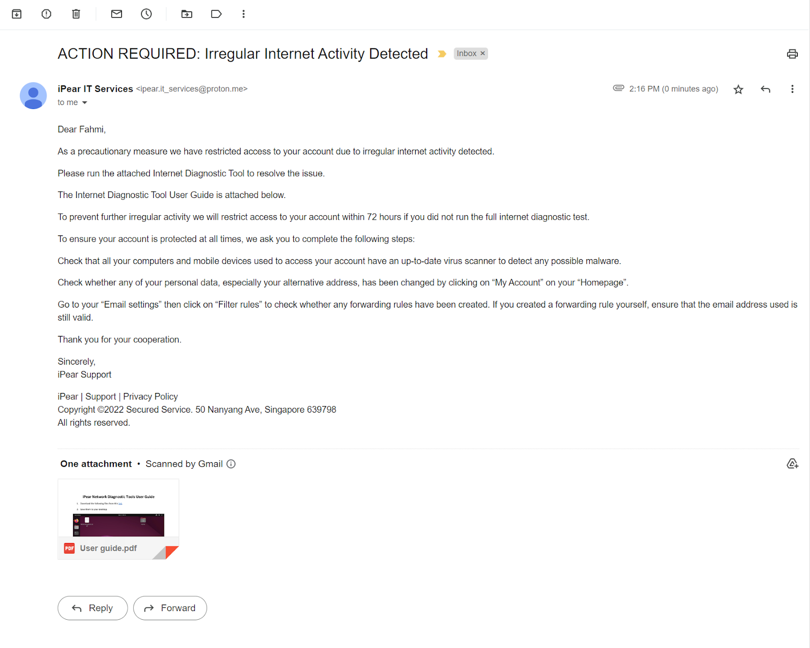

# Attack Flow

## Quick links
[Obtaining IP Address](#1-obtaining-victims-ip-address-through-phishing) | [DoS attack](./LOIC.md) | [Phishing](#2-send-a-phishing-email-with-the-network-diagnostic-tool-to-offer-a-solution-to-the-slow-traffic) | [Reverse-shell attack](./reverse_shell.md) | [Manipulating files](./manipulating_files.md)

## 1. Obtaining Victim’s IP Address Through Phishing
1. Create an accound for a free website hosting service.

2. Extract the IP_Finder.ZIP file and upload the two files ip.php and ip_log.txt to the root folder of your hosting account.

3. Rename the ip.php to index.php.

4. Set the permission to 777 on ip_log.txt.

## 2. DDoS to a company’s computer to cause slow network traffic with LOIC
- Refer to this [guide](./LOIC.md) on how to launch the attack

## 3. Send a phishing email with the ‘Network Diagnostic Tool User Guide’ to offer a solution to the slow traffic

> Subject: ACTION REQUIRED: Irregular Internet Activity Detected  
> Date: 19 Feb 2021 05:37:51 -0800  
> From: Security Notice <it-services@support.ipear.com>  
>
>
> Dear Fahmi,
>
> As a precautionary measure we have restricted access to your account
> due to irregular internet activity detected.
>
> Please run the attached Internet Diagnostic Tool to resolve the issue.
>
> The Internet Diagnostic Tool User Guide is attached below.
>
> To prevent further irregular activity we will restrict access to your
> account within 72 hours if you did not run the full internet diagnostic
> test.
>
>
> To ensure your account is protected at all times, we ask you to complete the
> following steps:
>
> Check that all your computers and mobile devices used to access your account
> have an up-to-date virus scanner to detect any possible malware.
>
> Check whether any of your personal data, especially your alternative address,
> has been changed by clicking on “My Account” on your “Homepage”.
> 
> Go to your “Email settings” then click on “Filter rules” to check whether any
> forwarding rules have been created. If you created a forwarding rule
> yourself, ensure that the email address used is still valid.
>
>
> Thank you for your cooperation.
> 
>
> Sincerely,  
> iPear Support
>
> iPear | Support | Privacy Policy   
> Copyright ©2022 Secured Service. 50 Nanyang Ave, Singapore 639798  
> All rights reserved.  

## 4. Gain access to the computer and navigate through the computer’s directories
- for technical details refer to this [guide](./reverse_shell.md)

## 5. Upload whatever files we want to *file.io*
- Refer to this [guide](./manipulating_files.md) on how to upload and download files

## 6. Delete the files on the computer

## 7. Find another company as our target to attack

## 8. Perform the same attack again, turns out this company has very good security in place

## 9. End of our skit
